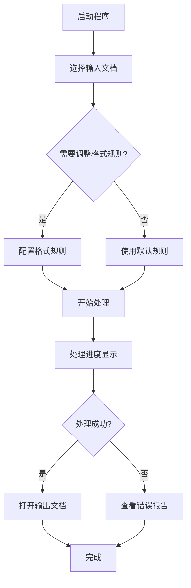

# 论文格式助手 - 产品需求文档 (PRD)

---

## 文档信息

| 项目 | 内容 |
|------|------|
| **产品名称** | 论文格式助手 |
| **版本** | v1.0 |
| **文档版本** | 1.0 |
| **创建日期** | 2026-04-08 |
| **文档状态** | 草案中 |
| **所有者** | 产品团队 |

---

## 目录

1. [产品概述](#1-产品概述)
2. [产品目标](#2-产品目标)
3. [目标用户](#3-目标用户)
4. [产品定位](#4-产品定位)
5. [功能需求](#5-功能需求)
6. [非功能需求](#6-非功能需求)
7. [用户流程](#7-用户流程)
8. [界面设计](#8-界面设计)
9. [技术架构](#9-技术架构)
10. [性能指标](#10-性能指标)
11. [安全需求](#11-安全需求)
12. [兼容性需求](#12-兼容性需求)
13. [未来规划](#13-未来规划)

---

## 1. 产品概述

### 1.1 产品简介

论文格式助手是一款基于 Microsoft Word 的智能格式化工具，专为学术写作场景设计。产品通过自动化识别论文文档结构，批量应用标准化格式规则，显著提升论文排版效率，减少人工调整时间。

### 1.2 核心价值

- **效率提升**：将数小时的格式调整工作缩短至数分钟
- **标准化**：确保论文格式符合学术规范和期刊要求
- **降低错误**：减少手动排版中的人为错误
- **批量处理**：支持一次对整篇论文进行统一格式调整

### 1.3 应用场景

- 学术论文写作与修改
- 学位论文排版
- 期刊投稿格式调整
- 毕业设计论文格式统一

---

## 2. 产品目标

### 2.1 短期目标（3-6个月）

- [ ] 完成 Windows 桌面版产品开发
- [ ] 支持常见论文模板（国标、GB、学校模板等）
- [ ] 实现核心格式规则的完整覆盖
- [ ] 建立用户反馈收集机制
- [ ] 完善错误处理和报告功能

### 2.2 中期目标（6-12个月）

- [ ] 发布 macOS 版本
- [ ] 支持自定义格式模板导入/导出
- [ ] 增加格式预览功能
- [ ] 支持批量文件处理
- [ ] 建立在线模板库

### 2.3 长期目标（12个月以上）

- [ ] 开发 Web 版本（支持浏览器内直接编辑）
- [ ] 支持协作功能（团队共享格式配置）
- [ ] AI 辅助功能（智能推荐格式）
- [ ] 与主流文献管理工具集成（如 EndNote、Zotero）

---

## 3. 目标用户

### 3.1 核心用户画像

| 用户类型 | 描述 | 痛点 | 需求 |
|----------|------|------|------|
| **硕博研究生** | 正在撰写学位论文，需要符合学校格式要求 | 格式调整繁琐，容易出错 | 快速、准确的批量格式化 |
| **高校教师** | 指导学生论文，需要检查格式规范性 | 人工检查效率低 | 自动化格式检查和修正 |
| **科研人员** | 发表期刊论文，需要符合期刊投稿格式 | 不同期刊格式差异大 | 支持自定义格式规则 |
| **期刊编辑** | 审核稿件，确保格式符合期刊规范 | 审核工作量大 | 批量格式检查工具 |

### 3.2 用户规模预估

- 个人用户：研究生、科研人员（50,000+）
- 机构用户：高校图书馆、期刊编辑部（500+）
- 企业用户：出版机构、培训机构（50+）

---

## 4. 产品定位

### 4.1 市场定位

**论文格式助手定位为：**
- **垂直领域**工具：专注学术论文格式化
- **SaaS 工具**：桌面应用 + 在线模板库
- **轻量级工具**：安装简便，即开即用
- **高性价比工具**：相比 Adobe InDesign 等专业排版软件，学习成本低

### 4.2 竞品分析

| 竞品 | 优势 | 劣势 | 我们的策略 |
|------|------|------|----------|
| **Microsoft Word 内置功能** | 用户熟悉，无需额外安装 | 功能分散，需要大量手动操作 | 提供一键批量格式化，减少操作步骤 |
| **专业排版软件（InDesign）** | 功能强大，适合出版 | 学习曲线陡峭，价格昂贵 | 面向学术写作场景，降低使用门槛 |
| **在线排版服务** | 无需安装，支持云端协作 | 隐私顾虑，网络依赖 | 本地处理，数据安全，支持离线使用 |
| **同类竞品** | 功能成熟 | 用户体验不佳，界面陈旧 | 现代化 UI 设计，提升用户满意度 |

### 4.3 差异化定位

1. **智能识别**：自动识别论文结构（标题、正文、图表、参考文献等）
2. **批量处理**：一次完成整篇论文格式调整
3. **模板化**：内置多种学术格式模板，支持自定义
4. **现代化体验**：简洁直观的用户界面

---

## 5. 功能需求

### 5.1 功能优先级

| 优先级 | 功能模块 | 版本规划 |
|--------|----------|----------|
| P0（核心） | 文档结构识别 | v1.0 |
| P0（核心） | 格式规则配置 | v1.0 |
| P0（核心） | 批量格式应用 | v1.0 |
| P1（重要） | 格式模板库 | v1.1 |
| P1（重要） | 错误报告生成 | v1.0 |
| P2（增强） | 格式预览 | v2.0 |
| P2（增强） | 批量文件处理 | v2.0 |
| P3（未来） | AI 智能推荐 | v3.0 |

### 5.2 核心功能需求

#### FR-001：文档结构自动识别

**需求描述：**
系统应能自动识别 Word 文档中的各类内容结构，包括但不限于：

| 结构类型 | 识别规则 |
|----------|----------|
| 封面 | 文档首段，居中对齐 |
| 摘要 | 关键词"摘要"、"Abstract"及其后续内容 |
|   - 摘要标题 | 独立段落，包含关键词 |
|   - 摘要内容 | 摘要标题后的正文段落 |
| 各级标题 | 按照编号规则识别 |
|   - 一级标题 | "第X章"、"X." 等格式 |
|   - 二级标题 | "第X节"、"X.X" 等格式 |
|   - 三级标题 | "X.X.X"、"一、" 等格式 |
|   - 四级标题 | "X.X.X.X"、"（一）" 等格式 |
| 正文内容 | 普通段落，非标题、非特殊内容 |
| 图表标题 | 包含"图X"、"表X"等标识 |
| 表格内容 | Word 表格中的文字内容 |
| 表格注释 | "资料来源："、"注："等标记内容 |
| 公式 | 独立数学公式段落 |
| 参考文献 | 关键词"参考文献"后的条目 |
|   - 参考文献标题 | 识别为标题，设置大纲级别 |
|   - 参考文献内容 | 识别为条目内容 |
| 致谢 | 关键词"致谢"、"Acknowledgement"及其内容 |
| 附录 | 关键词"附录"、"Appendix"及其内容 |

**验收标准：**
- [ ] 识别准确率 ≥ 95%（基于标准论文样本测试）
- [ ] 支持中英文混合文档
- [ ] 正确处理多级嵌套标题
- [ ] 区分标题与正文边界情况

---

#### FR-002：格式规则配置

**需求描述：**
用户应为每种文档结构类型配置独立的格式规则，包括：

| 格式属性 | 支持选项 | 默认值 |
|----------|----------|--------|
| 中文字体 | 宋体、黑体、楷体、仿宋、等 | 宋体 |
| 英文字体 | Times New Roman、Arial、Calibri 等 | Times New Roman |
| 字号 | 初号-八号（标准字号列表） | 小四 |
| 对齐方式 | 左对齐、居中、右对齐、两端对齐 | 两端对齐 |
| 行距 | 单倍-3倍、固定磅值 | 1.5倍 |
| 段前间距 | 0磅-48磅 | 0磅 |
| 段后间距 | 0磅-48磅 | 0磅 |
| 首行缩进 | 无、1-4字符 | 2字符（正文） |
| 整体缩进 | 无、左缩进、右缩进、左右缩进 | 无 |
| 加粗 | 是/否 | 否 |
| 倾斜 | 是/否 | 否 |

**验收标准：**
- [ ] 支持 17 种论文结构类型
- [ ] 每种类型支持 11+ 个格式属性
- [ ] 配置实时生效，无需重启
- [ ] 支持配置导入/导出

---

#### FR-003：批量格式应用

**需求描述：**
系统应能一次性将配置的格式规则应用到整文档：

- 支持段落格式批量应用
- 支持表格内容批量格式化
- 保持文档原始内容不变
- 支持中断处理（用户可取消）
- 提供处理进度反馈

**验收标准：**
- [ ] 处理速度：10 页文档 ≤ 5 秒
- [ ] 准确率：格式应用准确率 100%
- [ ] 支持大文件：支持 ≥ 100 页文档
- [ ] 异常处理：处理失败时提供详细错误信息

---

#### FR-004：错误报告生成

**需求描述：**
当处理过程中出现问题时，系统应自动生成错误报告：

| 报告内容 | 说明 |
|----------|------|
| 错误阶段 | 标识错误发生的处理阶段（段落处理/表格处理/保存等） |
| 位置信息 | 段落序号、章节标题等 |
| 识别类型 | 系统识别的文档结构类型 |
| 内容片段 | 问题段落的前 200 字符 |
| 错误信息 | 详细的技术错误堆栈 |

**验收标准：**
- [ ] 错误信息清晰可读
- [ ] 包含足够上下文信息便于定位问题
- [ ] 报告文件自动命名（基于原文件名）
- [ ] 支持致命错误和普通错误的区分

---

#### FR-005：文件操作

**需求描述：**
提供完整的文件输入输出管理：

- [ ] 选择输入 Word 文档
- [ ] 指定输出目录
- [ ] 自定义输出文件名
- [1] 打开输出文档
- [ ] 打开输出文件夹
- [ ] 覆盖保护（输出文件已存在时提示）

**验收标准：**
- [ ] 支持文件拖放
- [ ] 支持最近文件列表（可选）
- [ ] 输出路径合法性校验

---

### 5.3 增强功能需求（v1.1+）

#### FR-006：格式模板库（v1.1）

**需求描述：**
内置常见学术格式模板，支持一键应用：

| 模板类型 | 包含规范 |
|----------|----------|
| 国标 GB/T 7714 | 学术论文通用规范 |
| APA 格式 | 心理学、教育学等常用格式 |
| MLA 格式 | 人文社科类论文格式 |
| 高校定制模板 | 支持导入学校模板 |

**验收标准：**
- [ ] 内置 ≥ 5 种常用模板
- [ ] 支持模板预览
- [ ] 支持自定义模板保存

---

#### FR-007：格式预览（v2.0）

**需求描述：**
在应用格式前提供预览功能：

- [ ] 实时预览格式效果
- [ ] 对比原始格式
- [ ] 支持部分预览

---

#### FR-008：批量文件处理（v2.0）

**需求描述：**
支持一次选择多个文件批量处理：

- [ ] 多文件选择
- [ ] 批量处理进度显示
- [ ] 处理结果汇总报告

---

## 6. 非功能需求

### 6.1 性能需求

| 需求项 | 指标 |
|----------|------|
| 启动时间 | ≤ 3 秒 |
|   大文件加载 | 10MB 文件 ≤ 5 秒 |
| 格式应用速度 | 10 页文档 ≤ 5 秒 |
| 内存占用 | 运行时 ≤ 200MB |
| 响应性 | UI 操作响应 ≤ 100ms |

### 6.2 可用性需求

| 需求项 | 说明 |
|----------|------|
| 易学性 | 新用户 5 分钟内掌握基本操作 |
| 错误提示 | 清晰描述问题原因和解决方案 |
| 操作可逆 | 支持撤销格式应用（可选，v2.0+） |
| 帮助文档 | 内置使用说明和格式规范介绍 |

### 6.3 兼容性需求

| 需求项 | 支持范围 |
|----------|----------|
| 文件格式 | .docx（Microsoft Word 2007+） |
| 操作系统 | Windows 10/11 |
|   - 分辨率 | 1024×768 及以上 |
|   - DPI | 标准缩放（100%、125%、150%） |
| Word 版本 | Word 2010、2013、2016、2019、2021、365 |

### 6.4 可靠性需求

| 需求项 | 指标 |
|----------|------|
| 稳定性 | 连续处理 10 个文档无崩溃 |
| 数据完整性 | 文档处理后内容零丢失 |
| 错误恢复 | 意外错误时自动保存临时文件 |

### 6.5 安全性需求

| 需求项 | 说明 |
|----------|------|
| 本地处理 | 所有处理在本地完成，无需上传 |
| 隐私保护 | 不收集用户文档内容 |
| 文件完整性 | 输出文件校验和完整性检查 |

---

## 7. 用户流程

### 7.1 核心使用流程



### 7.2 详细步骤说明

| 步骤 | 操作 | 期望时间 | 用户反馈 |
|------|------|----------|----------|
| 1 | 启动程序 | < 1 秒 | 欢迎界面加载完成 |
| 2 | 选择论文文件 | < 5 秒 | 文件路径显示 |
| 3 | 查看默认格式规则 | - | 表格中显示默认配置 |
| 4 | 调整格式规则（可选） | 30-60 秒 | 配置项实时更新 |
| 5 | 点击"开始排版" | - | 开始处理，禁用按钮 |
|)   6 | 查看进度 | 5-30 秒 | 进度条和状态文字更新 |
| 7 | 处理完成通知 | - | 按钮恢复可用状态 |
| 8 | 打开输出文档 | < 2 秒 | Word 启动显示结果 |

---

## 8. 界面设计

### 8.1 设计理念

- **现代化**：采用清新学术风格，符合现代软件审美
- **专业性**：配色克制，避免过度装饰
- **高效性**：信息密度适中，减少滚动
- **一致性**：UI 元素风格统一

### 8.2 视觉规范

| 元素 | 设计规范 |
|------|----------|
| **主色调** | 明亮蓝色 (#3b82f6) |
| **背景色** | 浅灰色 (#F3F4F6) |
| **卡片背景** | 纯白色 (#ffffff) |
| **文字颜色** | 深灰色 (#334155) |
| **边框颜色** | 浅灰色 (#CBD5E1) |
| **圆角** | 6-12px |
| **字体** | Microsoft YaHei UI / Segoe UI |

### 8.3 界面布局

```
┌─────────────────────────────────────────────────────────────────┐
│  论文格式助手                                              │
├─────────────────────────────────────────────────────────────────┤
│                                                           │
│  ┌──────────────────────┐  ┌───────────────────────┐    │
│  │ 格式规则设置         │  │ 文件操作             │    │
│  │                      │  │                      │    │
│  │  ┌────────────┐     │  │ 选择论文文件        │    │
│  │  │ 表格     │     │  │ [____________] [浏览] │    │
│  │  │          │     │  │                      │    │
│  │  │ 结构   │    │  │ 输出文件位置        │    │
│  │  │ - 中文字体│  │  │ [____________] [浏览] │    │
│  │  │ - 英文字体│  │  │                      │    │
│  │  │ - 字号   │  │  │ 自定义文件名        │    │
│  │  │ - 对齐   │  │  │ [____________]       │    │
│  │  │ - 行距   │  │  │                      │    │
│  │  │ ...       │  │  │ [开始排版]          │    │
│  │  └────────────┘     │  │                      │    │
│  └──────────────────────┘  │ [打开文档] [打开文件夹]│    │
│                           │  │                      │    │
│                           │  │ ████░░░░░░░░░░░  60%│    │
│                           │  │ 正在处理段落...       │    │
│                           │  └───────────────────────┘    │
└─────────────────────────────────────────────────────────────────┘
```

### 8.4 交互设计

| 交互场景 | 设计要点 |
|----------|----------|
| **文件选择** | 支持点击浏览和拖放 |
| **格式配置** | 表格化编辑，下拉框选择 |
| **处理反馈** | 进度条 + 文字状态双重提示 |
| **错误提示** | 明确说明问题，提供解决建议 |
| **完成通知** | 清晰的成功提示，提供后续操作入口 |

---

## 9. 技术架构

### 9.1 技术栈

| 技术类型 | 选型 | 版本 | 说明 |
|----------|------|------|------|
| **开发语言** | Python | 3.12+ | 核心逻辑实现 |
| **GUI 框架** | PySide6 | 6.11.0 | Qt6 绑定，现代化 UI |
| **文档处理** | python-docx | 1.2.0+ | Word 文档读写 |
| **打包工具** | PyInstaller | 6.19.0+ | 生成独立 EXE |
| **运行平台** | Windows | 10/11 | 目标平台 |

### 9.2 系统架构

```
┌─────────────────────────────────────────────────────────────────┐
│                    用户界面层 (UI Layer)                │
│  ┌───────────────────────────────────────────────────────┐  │
│  │ 主窗口 (MainWindow)                              │  │
│  │   ├─ 标题区 (Header)                           │  │
│  │   ├─ 格式配置面板 (Format Panel)                  │  │
│  │   │   └─ 格式表格 (Format Table)                  │  │
│  │   └─ 文件操作面板 (File Panel)                    │  │
│  │       ├─ 文件选择 (File Selection)               │  │
│  │       ├─ 操作按钮 (Action Buttons)                 │  │
│  │       └─ 进度显示 (Progress Display)               │  │
│  └───────────────────────────────────────────────────────┘  │
└─────────────────────────────────────────────────────────────────┘
                           ↓ 事件驱动
┌─────────────────────────────────────────────────────────────────┐
│                   业务逻辑层 (Business Layer)              │
│  ┌───────────────────────────────────────────────────────┐  │
│  │ 格式管理器 (Format Manager)                      │  │
│  │   ├─ 规则配置管理                                │  │
│  │   └─ 规则验证                                    │  │
│  │                                                   │  │
│  │ 文档处理引擎 (Document Processor)                   │  │
│  │   ├─ 结构识别 (PartIdentifier)                    │  │
│  │   ├─ 格式应用 (FormatApplier)                    │  │
│  │   └─ 样式管理 (StyleManager)                      │  │
│  │                                                   │  │
│  │ 错误处理器 (Error Handler)                          │  │
│  │   └─ 报告生成                                    │  │
│  └───────────────────────────────────────────────────────┘  │
└─────────────────────────────────────────────────────────────────┘
                           ↓ 数据访问
┌─────────────────────────────────────────────────────────────────┐
│                    数据层 (Data Layer)                    │
│  ┌───────────────────────────────────────────────────────┐  │
│  │ Word 文档接口 (python-docx)                       │  │
│  │   ├─ 段落访问                                    │  │
│  │   ├─ 样式管理                                    │  │
│  │   └─ 表格处理                                    │  │
│  └───────────────────────────────────────────────────────┘  │
└─────────────────────────────────────────────────────────────────┘
```

### 9.3 核心模块说明

#### 模块 1：PartIdentifier（结构识别）

**职责**：识别 Word 文档中的段落类型

**关键方法**：
- `identify(paragraph, context)` → (part_type, is_title)
- `_normalize(text)` → 标准化文本用于匹配
- `_is_formula_paragraph(paragraph)` → 判断是否为公式段落

**识别逻辑**：
1. 特殊关键词匹配（摘要、参考文献、致谢、附录）
2. 标题模式匹配（一级-四级标题）
3. 图表标题匹配
4. 表格注释匹配
5. 基于上下文推断（摘要内容、参考文献内容等）

---

#### 模块 2：FormatApplier（格式应用）

**职责**：将格式规则应用到文档

**关键方法**：
- `apply_to_paragraph(paragraph, part_type)` → 应用段落格式
- `apply_to_table(table, rules)` → 应用表格格式
- `_apply_font(run, rule)` → 应用字体格式

**应用策略**：
- 样式驱动：创建/更新 Word 样式
- 清除直接格式：确保样式优先
- 特殊处理：保护图片、公式等特殊元素

---

#### 模块 3：StyleManager（样式管理）

**职责**：管理 Word 文档的样式

**关键方法**：
- `create_or_update_style(part_type, rule)` → 创建或更新样式
- `_set_paragraph_format(style, rule)` → 设置段落格式
- `_set_font_format(style, rule)` → 设置字体格式

**样式策略**：
- 基于段落类型命名样式（如"heading1"）
- 自动创建或更新现有样式
- 设置大纲级别（用于目录生成）

---

### 9.4 数据流

```
用户选择文件
    ↓
python-docx 读取文档
    ↓
PartIdentifier 遍历段落
    ↓
识别段落类型 (paragraph → part_type)
    ↓
FormatApplier 应用格式
    ↓
StyleManager 更新/创建样式
    ↓
python-docx 保存文档
```

---

## 10. 性能指标

### 10.1 关键指标

| 指标类型 | 目标值 | 测量方法 |
|----------|--------|----------|
| **启动性能** | < 3 秒 | 启动到主窗口显示时间 |
| **文件加载** | < 5 秒/10MB | 文件选择到就绪状态时间 |
| **识别性能** | > 100 段落/秒 | 结构识别吞吐量 |
| **格式应用** | < 0.05 秒/段落 | 单段落格式化时间 |
| **整体处理** | < 30 秒/10页 | 完整文档处理时间 |
| **内存占用** | < 200MB | 运行时峰值内存 |
| **EXE 文件大小** | < 100MB | 打包后安装包大小 |

### 10.2 性能优化策略

| 优化项 | 实现方式 |
|--------|----------|
| **懒加载** | 按需加载字体列表 |
| **缓存机制** | 缓存识别结果 |
| **批量操作** | 减少文档保存次数 |
| **事件驱动**"异步处理大文件 |
| **资源释放** | 及时清理临时对象 |

---

## 11. 安全需求

### 11.1 数据安全

| 安全要求 | 实现方式 |
|----------|----------|
| **本地处理** | 所有处理在本地完成，不上传文档 |
| **隐私保护** | 不收集用户文档内容和元数据 |
| **临时文件安全** | 处理完成后清理临时文件 |
| **权限控制** | 仅请求必要的文件读写权限 |

### 11.2 输入验证

| 验证项 | 验证规则 |
|--------|----------|
| **文件格式** | 仅接受 .docx 格式 |
| **文件大小** | 限制最大 500MB |
| **文件完整性** | 验证文件未损坏 |
| **路径合法性** | 检查输出目录可写权限 |

### 11.3 错误处理

| 错误类型 | 处理策略 |
|----------|----------|
| **文件读取失败** | 提示用户检查文件权限和完整性 |
| **格式应用失败** | 记录详细错误，生成报告，继续处理 |
| **保存失败** | 提示用户检查磁盘空间 |
| **未预期错误** | 生成崩溃报告，提供恢复建议 |

---

## 12. 兼容性需求

### 12.1 平台兼容性

| 平台 | 支持状态 | 说明 |
|------|----------|------|
| **Windows 10** | ✅ | 主要目标平台 |
| **Windows 11** | ✅ | 主流新系统 |
| **Windows Server** | ⏸️ | 暂不支持（v2.0+ 考虑） |
| **macOS** | ⏸️ | 规划中（v1.1+） |
| **Linux** | ⏸️ | 暂不规划 |

### 12.2 Word 版本兼容性

| Word 版本 | 兼容性 | 测试状态 |
|----------|---------|----------|
| **Word 2010** | ✅ | 待测试 |
| **Word 2013** | ✅ | 待测试 |
| **Word 2016** | ✅ | 待测试 |
| **Word 2019** | ✅ | 待测试 |
| **Word 2021** | ✅ | 待测试 |
| **Word 365** | ✅ | 待测试 |
| **WPS Office** | ⏸️ | 暂不支持 |

### 12.3 文档格式兼容性

| 格式 | 支持状态 | 说明 |
|------|----------|------|
| **.docx** | ✅ | 主要支持格式 |
| **.doc（旧版）** | ⏸️ | 建议用户转换 |
| **受保护文档** | ✅ | 支持读写 |
| **含宏文档** | ⚠️ | 宏可能丢失，提示用户 |
| **复杂布局** | ⚠️ | 部分支持，复杂情况可能需手动调整 |

---

## 13. 未来规划

### 13.1 v1.1 规划（3-6个月）

#### 新增功能

| 功能 ID | 功能名称 | 优先级 | 工作量估算 |
|--------|----------|--------|------------|
| FV-101 | 格式模板库 | P1 | 2 周 |
| FV-102 | 配置导入/导出 | P1 | 1 周 |
| FV-103 | 撤销功能（部分） | P2 | 3 周 |
| FV-104 | 最近文件列表 | P2 | 1 周 |
| FV-105 | 格式对比工具 | P2 | 2 周 |

#### 改进项

| 改进 ID | 描述 | 优先级 |
|--------|------|--------|
| IV-101 | 表格列冻结 | P1 |
| IV-102 | 格式规则搜索 | P2 |
| IV-103 | 错误处理优化 | P1 |

---

### 13.2 v2.0 规划（6-12个月）

#### 新增功能

| 功能 ID | 功能名称 | 优先级 |
|--------|----------|--------|
| FV-201 | 格式预览 | P0 |
| FV-202 | 批量文件处理 | P1 |
| FV-203 | 撤销/重做（完整） | P1 |
| FV-204 | 快捷键支持 | P2 |
| FV-205 | 自定义主题 | P2 |

#### 平台扩展

| 平台 | 功能 | 工作量 |
|------|------|--------|
| macOS | 完整移植 | 4 周 |
| Web 版本 | 基础功能上线 | 8 周 |

---

### 13.3 v3.0 规划（12-24个月）

#### 新增功能

| 功能 ID | 功能名称 | 优先级 |
|--------|----------|--------|
| FV-301 | AI 格式推荐 | P0 |
| FV-302 | 云端模板同步 | P1 |
| FV-303 | 团队协作功能 | P2 |
| FV-304 | 插件系统 | P2 |
| FV-305 | API 开放（第三方集成）| P2 |

#### AI 能力

| 能力类型 | 描述 |
|----------|------|
| **智能识别** | 基于文档内容推荐结构类型 |
| **格式推荐** | 根据期刊类型推荐格式 |
| **质量检查** | 自动检测格式不一致问题 |
| **学习优化** | 根据用户习惯优化默认规则 |

---

## 附录

### A. 术语表

| 术语 | 定义 |
|------|------|
| **段落类型** | 系统识别的文档结构分类（如 heading1、body 等） |
| **样式驱动** | 通过创建和更新 Word 样式来实现格式化 |
| **大纲级别** | Word 文档结构层级，用于目录生成 |
| **直接格式** | 直接应用于段落或字体的格式（非样式） |
| **段前/段后间距** | 段落前后的空白距离（磅） |
| **首行缩进** | 段落第一行的缩进距离 |

### B. 参考资料

1. python-docx 官方文档：https://python-docx.readthedocs.io/
2. PySide6 官方文档：https://doc.qt.io/qtforpython/
3. PyInstaller 文档：https://pyinstaller.org/
4. GB/T 7714 科学技术报告编号规则编写规范：国家标准全文公开系统

### C. 变更记录

| 版本 | 日期 | 变更内容 | 作者 |
|------|------|----------|------|
| v1.0 | 2026-04-08 | 初始版本，实现核心功能 | 产品团队 |

---

**文档结束**
